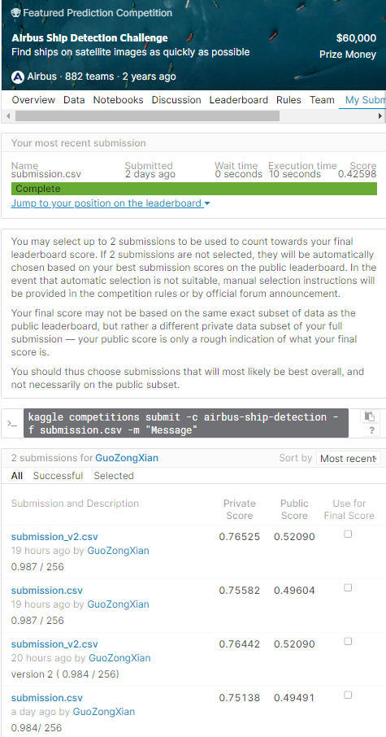

## kaggle competition: airbus ship detection challenge

## what is EncodedPixels?

* It is the way to express the location of pixels containing an object, like a list in one dimension, instead of using two dimensions or coordenates.
If the object is on the row 1, between pixels 5 and 5, you can express it like : 5 5 , and like this for every row.

-----------
## Data Prepare

- [ ] Delete useless images without ships
- [ ] Add index for ships existence(0 or 1)
- [ ] drop and split train & valid set

## Step 1 Detect ship existence - classification_ships_UResnet34.py
- [ ] Do transfer learning with Resnet34 
- [ ] Load training and valid set
- [ ] Image size 256 x 256, RGB data

## Step 2-1 ship semantic segmentationn - train.py
- [ ] Use Unet Base on ResNet34 model 
- [ ] Load training and valid set
- [ ] Image size 256 x 256, RGB data

## Step 2-2 ship semantic segmentationn - train_v2.py
- [ ] Use Unet Base on ResNet34 model
- [ ] Use pre-trained from Step 1
- [ ] Load training and valid set
- [ ] Image size 256 x 256, RGB data

## Submission result with predict ship + Unet34 - submit.py

 

## Ref.

1. [Simple transfer Learning detect Ship exist (Keras)](https://www.kaggle.com/super13579/simple-transfer-learning-detect-ship-exist-keras "title")

2. [U-Net base on ResNet34 Transfer learning (Keras)](https://www.kaggle.com/super13579/u-net-base-on-resnet34-transfer-learning-keras/notebook "title")

3. [Unet34 (dice 0.87+)](https://www.kaggle.com/iafoss/unet34-dice-0-87/comments? "title")

4. [Fine-tuning ResNet34 on ship detection](https://www.kaggle.com/iafoss/fine-tuning-resnet34-on-ship-detection "title")

5. [My weights file](https://drive.google.com/drive/folders/1ES5ivDV-4FxdqCwD7EvMf1c1KrpoCVaO?usp=sharing "tilte")